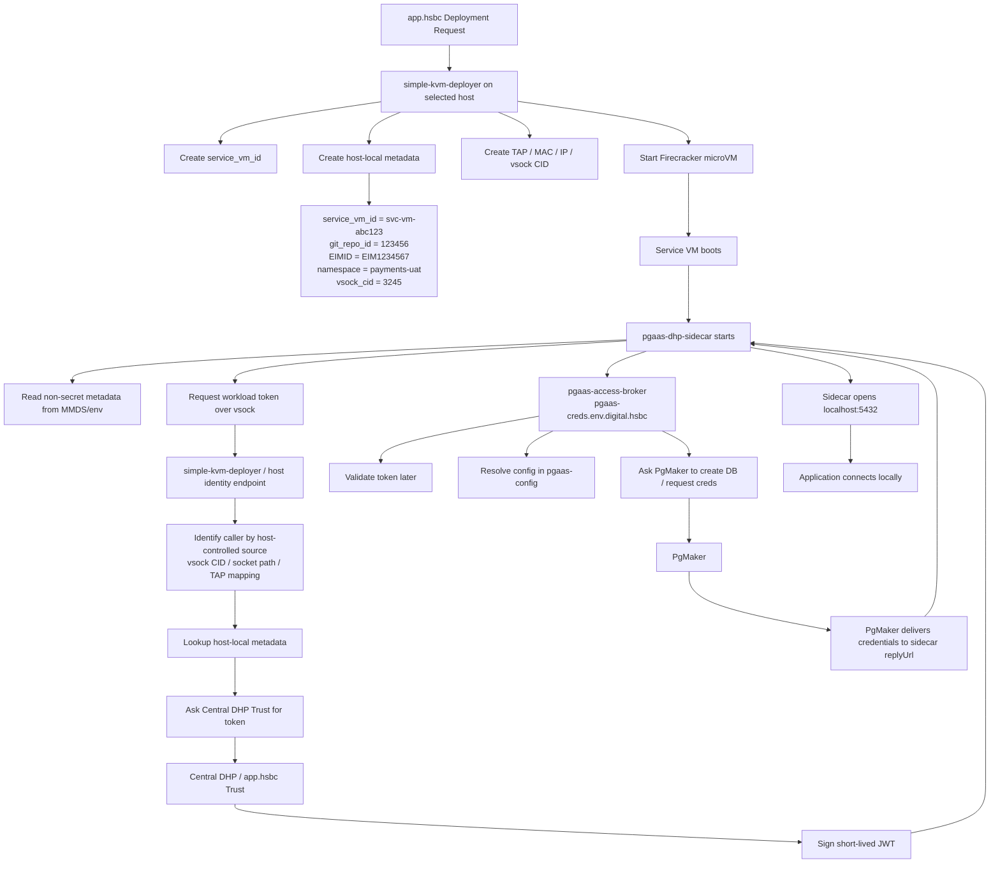
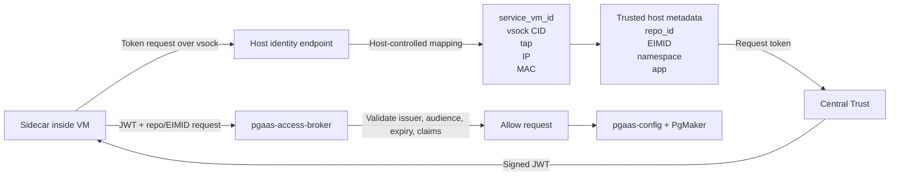
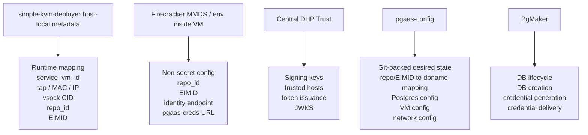
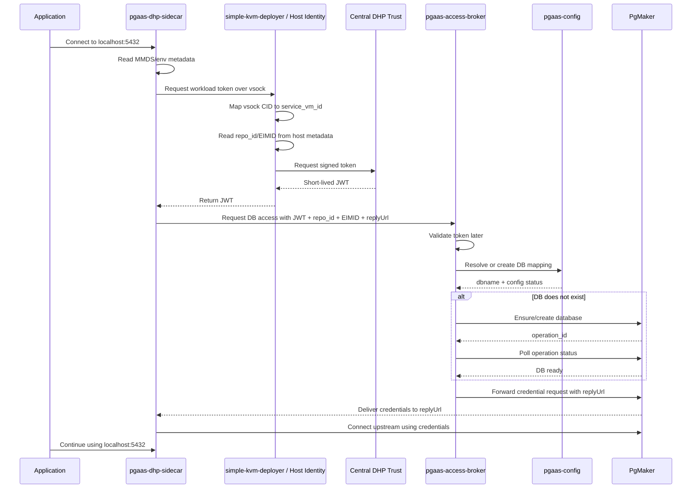
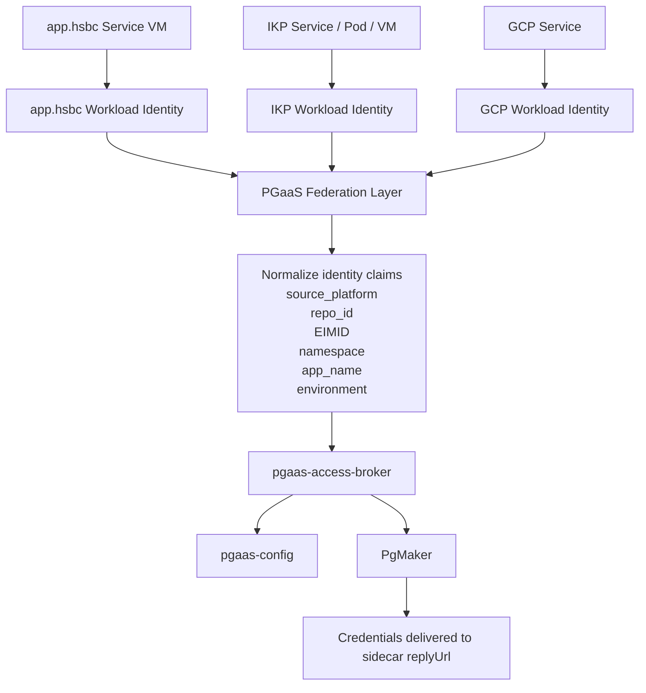
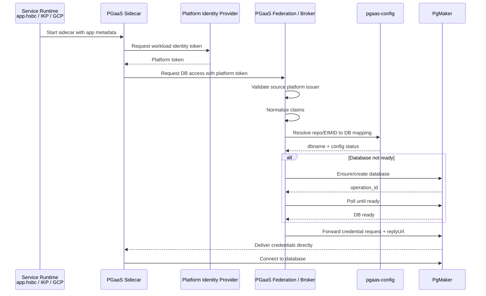
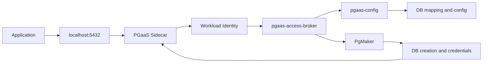
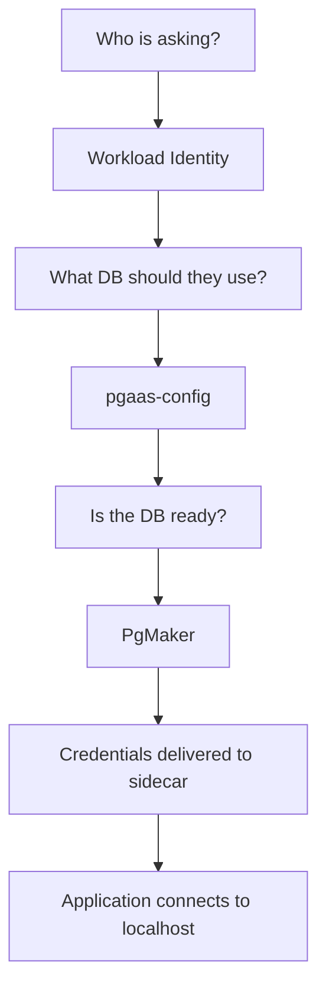

Below are **presentation-ready diagrams** you can use in your sharing session.

# 1. Workload identity with `simple-kvm-deployer`

This is the clean model for **app.hsbc service VM running on Firecracker**.



## Simple explanation for audience

Use this line:

> Firecracker runs the VM, but `simple-kvm-deployer` knows **which VM belongs to which repo, EIMID and namespace**.

The VM should not simply say:

```text
I am repo 123456.
```

Instead, the host proves it:

```text
This token request came from vsock CID 3245.
CID 3245 belongs to service_vm_id svc-vm-abc123.
svc-vm-abc123 belongs to repo 123456 and EIM1234567.
```

That is the trust chain.

---

# 2. Trust chain diagram

This is the most important security diagram.



## Key message

```text
MMDS tells the guest what it is configured as.
vsock proves to the host which VM is asking.
Central trust signs the identity.
pgaas-access-broker validates the token.
PgMaker acts only after trust is established.
```

---

# 3. What should be stored where

Use this diagram when explaining “who owns what.”



## One-liner

> Runtime identity lives with the host. Desired database state lives in `pgaas-config`. Credentials live only in PgMaker.

---

# 4. Workload identity sequence diagram

This is useful for developers.



---

# 5. Cross-platform workload identity

This is the future model where service can run in **app.hsbc, IKP, or GCP**, but database can still be PgMaker.



## Explain like this

Each platform has its own way to prove workload identity:

```text
app.hsbc: Firecracker VM + simple-kvm-deployer + central trust
IKP: Kubernetes/service workload identity
GCP: GCP service account / workload identity
```

But PGaaS should normalize them into one common identity shape:

```json
{
  "source_platform": "ikp",
  "git_repo_id": "123456",
  "EIMID": "EIM1234567",
  "namespace": "payments-uat",
  "app_name": "payment-service",
  "environment": "uat"
}
```

Then `pgaas-access-broker` does not care where the app is running. It only cares whether the workload identity is trusted and whether the app is allowed to access the DB.

---

# 6. Cross-platform sequence diagram



---

# 7. Best slide version

For a company-wide session, use this simplified diagram:



Narration:

> The application only sees localhost.
> The sidecar proves who the workload is.
> The broker resolves what database the app should use.
> PgMaker creates the database and sends credentials directly to the sidecar.

---

# 8. Most important takeaway slide



Use this as your closing architecture slide.

Final message:

> Workload identity answers **who is asking**.
> `pgaas-config` answers **which database belongs to them**.
> PgMaker answers **how to create and secure that database**.
> The sidecar makes it all feel like `localhost`.
